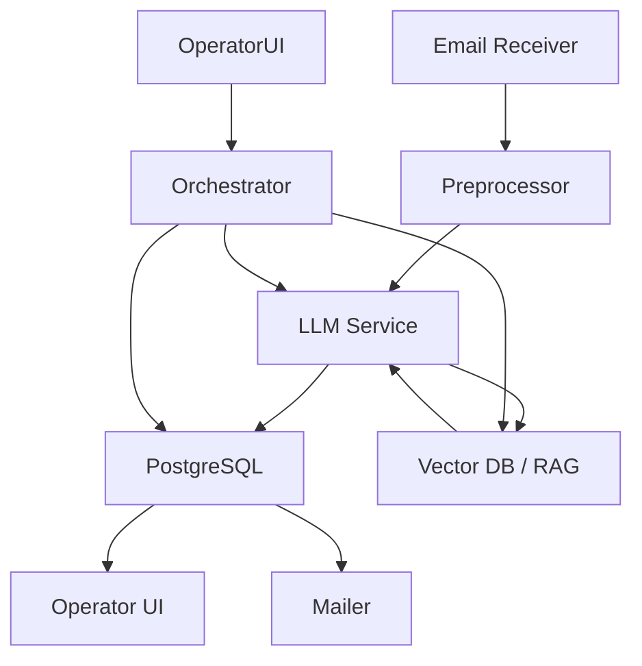

# AI-агент для обработки писем технической поддержки

## Описание проекта

**Цель системы** — разработать AI-агента, который автоматически:

- извлекает ключевые данные из письма;
- классифицирует обращение;
- формирует корректный ответ на основе базы знаний;
- принимает решение об автоответе или передаче оператору.

Система должна минимизировать нагрузку на операторов и при этом снижать риски некорректных ответов.

---

## Содержание

1. [Общий алгоритм работы системы](#общий-алгоритм-работы-системы)
2. [Пользовательский путь (operator flow)](#пользовательский-путь-operator-flow)
3. [Архитектура системы](#архитектура-системы)
4. [Структура БД (пример)](#структура-бд-пример)
5. [Формат извлечения сущностей (пример)](#формат-извлечения-сущностей-пример)
6. [RAG — поиск по базе знаний](#rag-—-поиск-по-базе-знаний)
7. [Оценка уверенности и маршрутизация](#оценка-уверенности-и-маршрутизация)
8. [Обработка повторных писем](#обработка-повторных-писем)
9. [Риски и меры минимизации](#риски-и-меры-минимизации)


---

## Общий алгоритм работы системы

### Шаг 1. Получение обращения

**Вариант A. Получение письма**

Письмо поступает на корпоративную почту и автоматически загружается в систему. Выполняется:

- извлечение темы письма;
- извлечение текста;
- очистка от подписи, цитирования предыдущих писем и т. д.

#### Шаг 1.2. Извлечение сущностей

Используется LLM (например Qwen‑Instruct) с выводом в строгом JSON‑формате.

Извлекаются поля:

- `organization` — название организации;
- `fio` — ФИО;
- `phone` — контактный телефон;
- `device_type` — тип прибора;
- `serial_number` — заводской номер;
- `problem_description` — суть неисправности / вопрос.

**Пример формата ответа модели:**

```json
{
  "organization": "",
  "fio": "",
  "phone": "",
  "device_type": "",
  "serial_number": "",
  "problem_description": ""
}
```

#### Шаг 1.3. Классификация обращения

Классификация также выполняется через ту же LLM.

**Категории (пример):**

- Неисправность
- Гарантийный случай
- Консультация
- Жалоба
- Другое

Модель возвращает:

- категорию;
- оценку уверенности `p_cat` (0–1);
- ключевые слова из запроса.

Информация сохраняется в карточке обращения.


**Вариант B. Получение заявки через форму**

Если заявка пришла через форму — сущности уже извлечены и шаг 1.2 пропускается; выполняется шаг 1.3.


### Шаг 2. Создание карточки обращения

После извлечения/классификации создаётся первичная запись в БД (PostgreSQL).

**Примерная структура таблицы:**

| Поле | Тип | Описание |
|---|---:|---|
| id | UUID / serial | Идентификатор обращения |
| email | string | Адрес клиента |
| organization | string | Название организации |
| fio | string | ФИО клиента |
| phone | string | Телефон |
| device_type | string | Тип прибора |
| serial_number | string | Заводской номер |
| category | enum | Категория обращения |
| confidence_score | float | Итоговый confidence (0–1) |
| status | enum | Статус обращения (new, ai_generated, operator_review, closed) |
| ai_generated_answer | text | Текст ответа, сгенерированный AI |
| operator_answer | text | Версия ответа оператора |
| created_at | timestamptz | Дата создания |
| updated_at | timestamptz | Дата обновления |


### Шаг 3. Поиск по базе знаний (RAG)

- Векторизация базы знаний (FAISS, Milvus, Pinecone и т. п.).
- Поиск `top_k` релевантных документов.
- Передача найденных документов в контекст LLM.


### Шаг 4. Оценка уверенности (intermediate)

Confidence формируется на основе:

- уверенности классификации;
- релевантности найденных документов (cosine similarity).

Если уверенность > порогового значения (например, `0.8`) — переходим к шагу 5, иначе — письмо направляется оператору.


### Шаг 5. Получение инструкции (стрикты промпт)

Модель получает строгую инструкцию:

- используй только информацию из предоставленного контекста;
- если информации недостаточно — сообщи об этом;
- не добавляй факты, отсутствующие в базе знаний.

Это снижает вероятность галлюцинаций.


### Шаг 6. Генерация ответа

LLM генерирует стандартизированный ответ со структурой:

1. Обращение к клиенту;
2. Краткое описание проблемы (summary);
3. Рекомендации / шаги решения;
4. Контакт для дальнейшей связи.

Ответ сохраняется в карточке обращения; статус меняется на `ai_generated`.


### Шаг 7. Оценка уверенности (final)

Итоговый `confidence_score` формируется на основе:

- уверенности классификации;
- релевантности найденных документов (cosine similarity);
- self‑evaluation модели (метрика качества сгенерированного ответа).

Результат сохраняется в БД.


### Шаг 8. Маршрутизация обращения (гибридная модель)

Порог `p` — значение, по которому принимается решение об автоматической отправке.

**Вариант A — Автоматическая отправка**

Если `confidence_score > p` и категория типовая и найдены релевантные документы — ответ автоматически отправляется клиенту. Статус — `closed (AI)`.

**Вариант B — Проверка оператором**

Если `confidence_score <= p` — ответ отправляется оператору на проверку. Оператор может внести правки, изменить категорию, запросить уточнение или отправить ответ. Статус обновляет оператор.


### Шаг 9. Обработка повторных писем

Если клиент отвечает на уже существующее обращение:

- выполняется обработка текста;
- письмо привязывается к текущей карточке;
- передаётся вся история переписки в контекст модели;
- статус автоматически обновляется.

Можно добавить дополнительные правила (ключевые слова), по которым письмо сразу будет передаваться сотруднику техподдержки.


---

## Пользовательский путь (Operator flow)

**Кратко:** оператор получает уведомление о новых письмах, просматривает/редактирует AI‑ответы при необходимости и отправляет итоговое сообщение клиенту. Ниже — шаги.

1. Получение уведомления о новом письме / новой карточке.
2. Открытие карточки: просмотреть извлечённые сущности, категорию, confidence, найденные документы RAG.
3. Если `confidence_score > p` и статус `ai_generated` — карточка может быть автоматически закрыта; оператор может просмотреть историю.
4. Если `confidence_score <= p` — оператор получает задачу на проверку. Он видит AI‑ответ, может редактировать текст, менять категорию, добавлять комментарии.
5. Оператор отправляет ответ (через интерфейс — отправить письмо). Статус меняется на `closed (operator)`.
6. Просмотр таблицы: фильтры по статусу, категории, дате, confidence; экспорт CSV.

**Таблица / схема пользовательского пути**

```mermaid
flowchart LR
  A[Поступление письма] --> B[Очистка письма]
  B --> C[Извлечение сущностей (LLM)]
  C --> D[Классификация (LLM)]
  D --> E[Создание карточки в БД]
  E --> F[RAG: поиск релевантных документов]
  F --> G[Генерация ответа (LLM)]
  G --> H[Оценка confidence]
  H -->|> порог p| I[Автоотправка]
  H -->|<= порог p| J[Отправка оператору на проверку]
  J --> K[Оператор редактирует и отправляет]
  I --> L[Статус: закрыт (AI)]
  K --> M[Статус: закрыт (operator)]
```

> Примечание: Mermaid диаграммы можно визуализировать в GitHub / VSCode с поддержкой Mermaid.


---

## Архитектура системы

**Компоненты:**

- **Email Receiver** — сервис, который принимает письма (IMAP/SMTP webhook) и выполняет предобработку (очистка, извлечение текста);
- **Preprocessor** — очистка от подписи, ответов, нормализация текста;
- **LLM Service** — API для инференса LLM (извлечение сущностей, классификация, генерация ответа);
- **Vector DB / RAG** — хранение векторных представлений базы знаний (FAISS/Milvus/Pinecone);
- **PostgreSQL** — хранилище карточек обращений и метаданных;
- **Confidence Scorer** — сервис для вычисления итогового `confidence_score`;
- **Orchestrator / Worker** — отвечает за последовательность шагов (очереди, retry, кэширование);
- **Operator UI** — веб‑интерфейс для просмотра карточек, таблицы, правок и отправки писем;
- **Mailer** — сервис отправки ответных писем (SMTP).

**Как взаимодействуют компоненты (упрощённая диаграмма):**




---

## Структура БД (пример)

```sql
CREATE TABLE tickets (
  id UUID PRIMARY KEY,
  email TEXT,
  organization TEXT,
  fio TEXT,
  phone TEXT,
  device_type TEXT,
  serial_number TEXT,
  category TEXT,
  confidence_score FLOAT,
  status TEXT,
  ai_generated_answer TEXT,
  operator_answer TEXT,
  created_at TIMESTAMPTZ DEFAULT now(),
  updated_at TIMESTAMPTZ DEFAULT now()
);
```


---

## RAG (Retrieval-Augmented Generation)

1. Индексация базы знаний: документы → эмбеддинги → векторная БД.
2. При обработке запроса: получить `top_k` документов по cosine similarity.
3. Подготовить контекст для LLM: включить только релевантные отрывки, обрезать длину контекста.
4. В промпте: явное указание использовать только предоставленные документы.


---

## Оценка уверенности и маршрутизация

**Формирование confidence_score** — агрегирование:

- `conf_class` — уверенность в классификации;
- `avg_sim` — средняя cosine similarity для top_k документов;
- `self_eval` — метрика самооценки качества ответа (например, модель выдаёт оценку качества ответа).

Пример простого формула‑подхода:

```
confidence_score = 0.4 * conf_class + 0.4 * avg_sim + 0.2 * self_eval
```

Порог `p` настраиваемый (например, 0.8). Если `confidence_score > p` — автоотправка, иначе — проверка оператором.


---

## Обработка повторных писем

- Сопоставление по `email` и `serial_number` или `ticket_id` в subject / in‑reply‑to.
- Подтягивание истории переписки в контекст LLM.
- Обновление карточки и генерация нового ответа (при необходимости).


---

## Риски и меры минимизации

### 1. Риск нестабильной работы LLM
**Проблема.** LLM может генерировать некорректные ответы, «галлюцинировать» или добавлять непроверенные факты.

**Минимизация.**
- Использование RAG;
- Жёсткий промпт с запретом добавления внешней информации;
- Ограничение формата ответа;
- Human‑in‑the‑loop (операторская проверка при низком confidence);
- Добавление confidence‑score для маршрутизации.


### 2. Риск неправильного извлечения сущностей
**Проблема.** Ошибки при извлечении могут привести к некорректной классификации или ответу.

**Минимизация.**
- Структурированный JSON‑output от LLM;
- Валидация полей (формат телефона, длина серийного номера и т. п.);
- При отсутствии критически важных данных — автоматический запрос уточнения у клиента;
- Возможность ручной корректировки оператором.


### 3. Риск производительности
**Проблема.** Инференс LLM может занимать значительное время, особенно без GPU.

**Минимизация.**
- Использование оптимизированных моделей;
- Ограничение длины контекста;
- Кэширование результатов;
- Асинхронная обработка писем (через очереди).


### 4. Организационные риски
**Проблема.** Распыление задач, потеря времени на второстепенные функции.

**Минимизация.**
- Чёткое разделение ролей: AI‑разработка, Backend, Интеграция, Интерфейс;
- Фокус на рабочем прототипе;
- Короткие синхронизации каждые 2–3 часа.


---

## Приложение: Mermaid‑диаграмма архитектуры (код)

```mermaid
flowchart TD
  subgraph Ingestion
    A[Email Receiver\n(IMAP / webhook)] --> B[Preprocessor\n(cleaning / parsing)]
  end

  subgraph AI
    C[LLM Service\n(entity extraction, classification, generation)]
    D[Vector DB / RAG\n(FAISS / Milvus / Pinecone)]
  end

  subgraph Storage
    E[PostgreSQL\n(tickets)]
  end

  subgraph Orchestration
    O[Orchestrator / Worker]
  end

  B --> O
  O --> C
  C --> D
  D --> C
  C --> E
  O --> E
  E --> UI[Operator UI]
  E --> Mailer[Mailer (SMTP)]
  UI --> O
```

